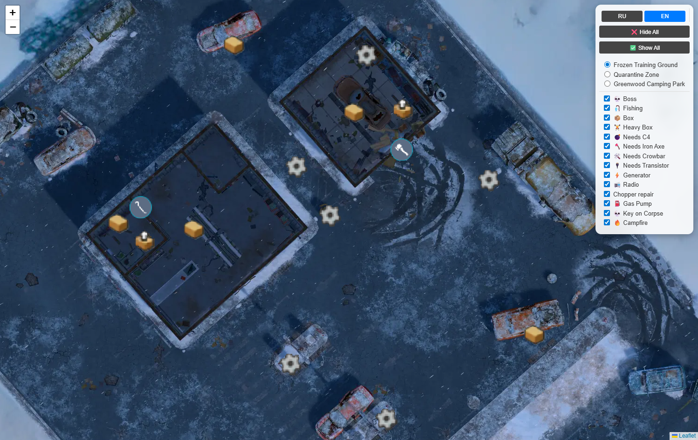
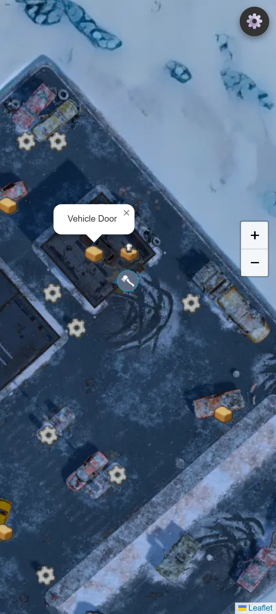

# LDOE Scout 🗺️

Interactive map project for Last Day on Earth: Survival. This tool is designed for seamless navigation through game locations, tracking resources, bosses, and other key points of interest.

## 🚀 Features
- **High Performance:** Powered by a tile-based system (Leaflet.js), ensuring smooth operation even with ultra-high-resolution maps.
- **Multi-language Support:** Fully localized in English and Russian.
- **Adaptive UI:** The interface dynamically adjusts to your screen size. It works perfectly as a desktop companion or a mobile tool.
- **Customizable Overlays:** Toggle specific marker groups to filter the information you need.

## 📸 Screenshots
| Desktop Version | Mobile Version |
| :---: | :---: |
|  |  |

## 🛠 Tech Stack
- **Frontend:** HTML5, CSS3, JavaScript.
- **Mapping Engine:** [Leaflet.js](https://leafletjs.com/).
- **Image Processing:** [libvips](https://www.libvips.org/) for efficient tile generation.

## 📦 Map Tiling Process
To ensure fast loading times, large map images are sliced into `.webp` tiles using the Google Layout format.

Command used for tile generation:
```bash
.\vips\bin\vips.exe arrayjoin "part1.png part2.png part3.png part4.png part5.png part6.png part7.png part8.png part9.png" large.v --across 3

.\vips\bin\vips.exe dzsave "large.v" tiles --layout google --suffix .webp --background "255 255 255 0" --tile-size 512 --skip-blanks 20
```

## ⚙️ Installation
1. Clone the repository:
```bash
   git clone https://github.com/ovgamesdev/ldoe-scout.git
```
2. Generate your map tiles using the command above and place them in the `tiles/map` directory.
3. Launch `index.html` using a local web server (e.g., VS Code Live Server).

## 📱 User Interface
- **Desktop:** The control panel (languages, filters) is docked at the top-right for quick access.
- **Mobile/Small Windows:** All controls collapse into a single Gear icon ⚙️ to save screen space. Zoom controls (+/-) are moved to the left-center for ergonomic one-handed use.
